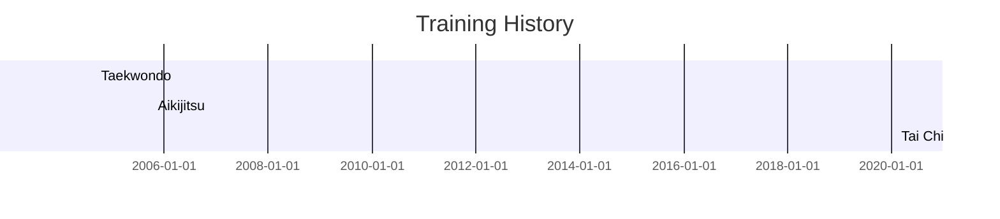

| Art       | Start    | End      | Teachers                                        | Notes                                                                 |
| --------- | -------- | -------- | ----------------------------------------------- | --------------------------------------------------------------------- |
| Taekwondo | 2004 Sep | 2005 Oct | Karen Armour (Ottawa) James Taylor (Sarnia) | High-octane aerobic kicking, not much else                            |
| Aikijitsu | 2005 Oct | 2012 Sep | James Carrothers                                | Serious martial art, hybrid of Japanese external and Chinese internal |
| Tai Chi   | 2020 Jan | ongoing  | Fernando Salinas Phil Vallance              | Simplified tai chi based on Yang family frame                         |

## Tai Chi

- CTCA - Canadian Tai Chi Academy
- simplified version of original tai chi (Yang frame)
    - thin stances
    - no push hands
    - focus on stretching tendons, loosening joints, no martial applications
- form adapted by Moy Lin Shin, teaching in Canada from 1970 until death in 1998
- started as Taoist Tai Chi Society
- CTCA split off in 2006
